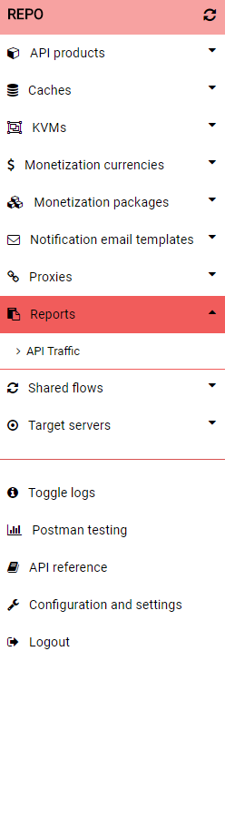

# Selecting an Apigee item from the sidebar
Once the [settings have been configured](./setup.md) and [HC API options have been selected](./header_options.md), the side bar will unlock revealing a list Apigee items. Clicking on one, eg. API products, will show each of the individual items that are either contained in Apigee or the Repo depending on the selected view.

Clicking on an indivdual item will display the items details in the center of screen and present a number of options depending on the [selected view option](./header_options.md) and type of item. These options include [getting, creating or updating the item in Apigee](./queues.md) as well as [deleting the item from Apigee or performing some specific operations](./additional_options.md).

