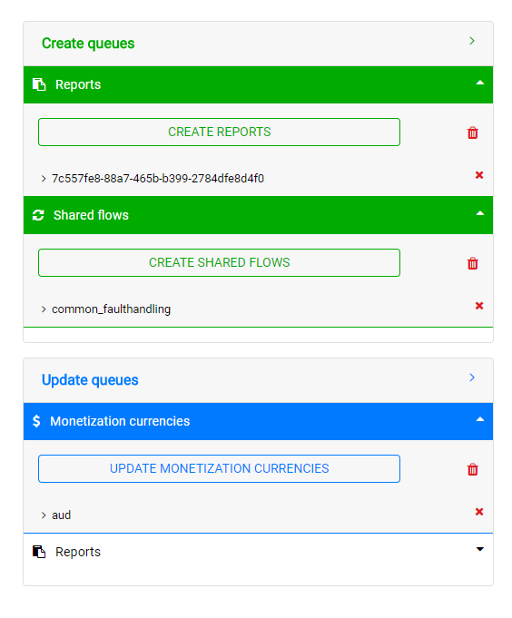

# Item queues
When an item is selected from the [side bar](./item.md) that item is set as active and its details are displayed in main screen. Some additional boxes are also displayed on the right hand side of the screen depending on the selected view:

#### Apigee View
- **Procure Queues:** Items added to this queue will have their definitions pulled down from the selected org and env and the data will be written to the specified repo

#### Repo View
- **Create Queues:** Items added will be created in the specified org and env in Apigee using data from the repo.
- **Update Queues:** Items added will have their information updated in Apigee using data from the repo.

You can add an item to a queue by clicking on its respective button in the item details section.

Each queue can hold multiple items of different types and is essentially what makes up the request body in export, import and update API calls made to the HC API. Clicking on the execute button under a subtitle in each queue will execute the respective request for that queue. In the example below, clicking the 'CREATE SHARED FLOWS' button will import a new version of each shared flow in the queue into Apigee and deploy it. 

The output of executing a queue request can be seen in the [logger](./logger.md) at the bottom of the home screen. Additionally, multiple queues for different item types can be run simultaneously.

