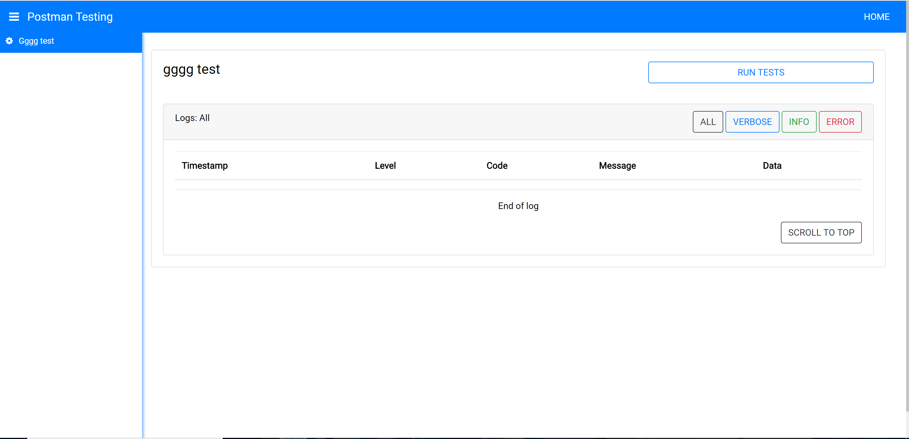

# Running autmoated tests using Postman
In the [setting and configuration](./setup,md) section of the app you are able to upload postman collection and environments, here you can run these tests using [Newman](https://www.npmjs.com/package/newman).

After selecting a test suite from the side bar, clicking the 'RUN TESTS' button will run the selected test and output the results to the [logger](./logger.md) as well as to the servers terminal console. Multiple tests can be run simultaneously but two sets of the same test can not be run at the same time. 

