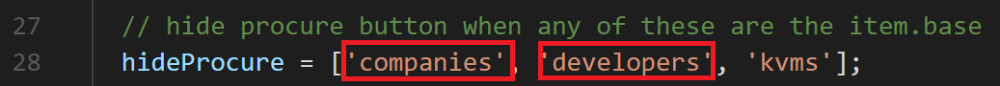
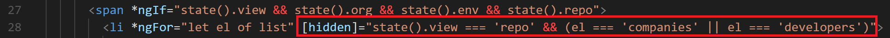
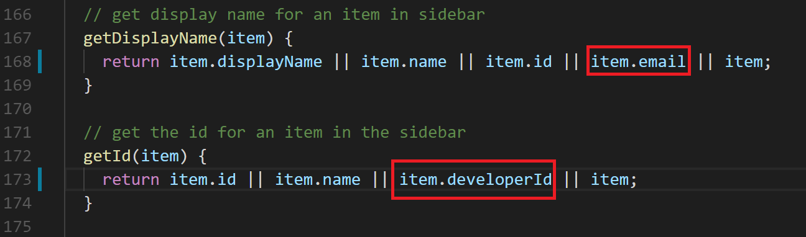
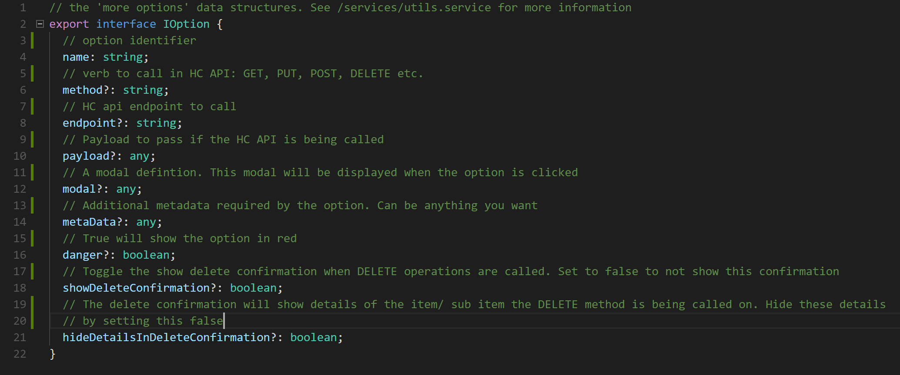
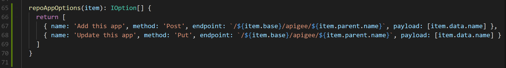
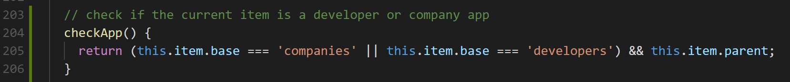
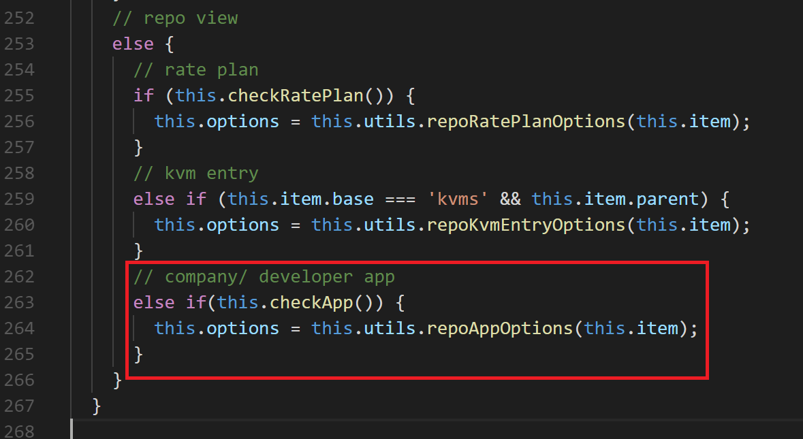
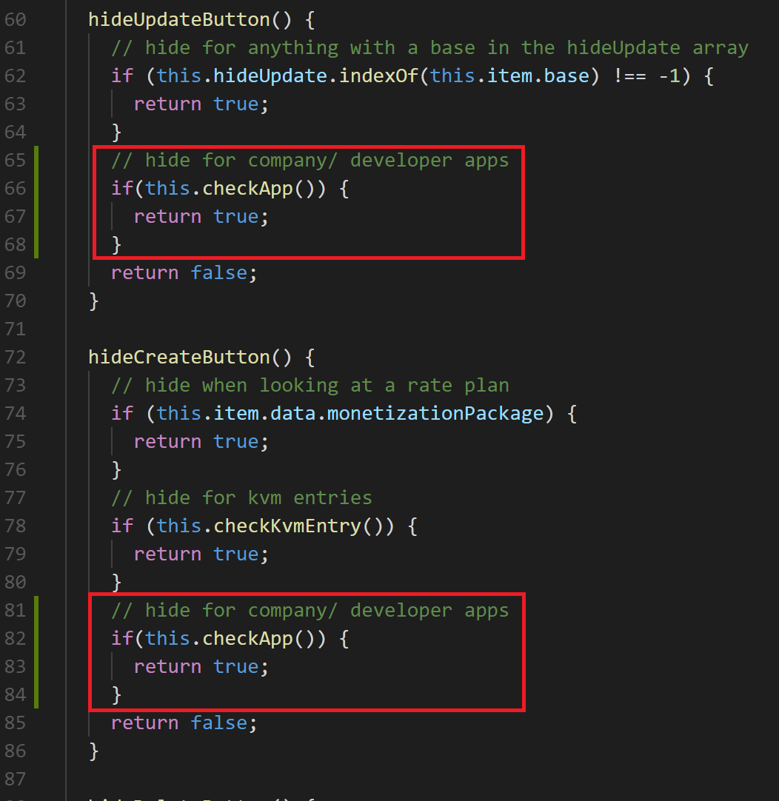
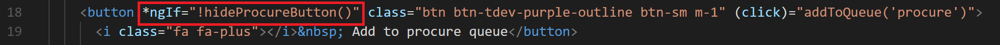
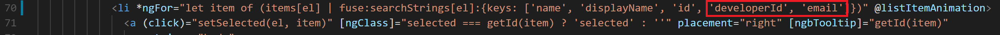

### Modifying the front end

Now that we have our backend set up to allow the importing, exporting and updating of companies and company apps we need to make a few slight adjustments to the front end to refelct this change.

For the most part the front end will take care of itself but in its inital implementation companies, developers and their corresponding apps were excluded. This will also show a pretty good overview of how the front end works.

This tutorial will focus specifically on how to make changes the source code in the front end application in order to add the export, import and update functionality to developers, developer apps, companies and company apps. For more information on the front end please see the [front end user guide](../setup.md).

The front end is built using [Angular 5](https://angular.io/) and [Angular Bootstrap](https://ng-bootstrap.github.io/#/home).

Before the modifications, the front end does not show **procure**, **create** or **update** options developers, companies and their respective apps. Additionally, the **repo view** does not show options for **companies** or **developers** in the sidebar. We are going to make the following modifications to the front code:

- Add the procure button to **companies** and **developers**
- Have **companies** and **developers** appear in the side bar in the **repo** view
- Update the sidebar menu text and tooltip for **developers**
- Show **procure** options for **companies** and **developers** in the **apigee** view
- Hide the **procure** option for **company and developers apps**
- Use the **utils service** and **more options** button to **create** and **update** apps in the **apigee** view, similar to how KVMs work.

To start we'll get the **procure** functionality working for **companies** and **developers** in the **apigee** view. Navigate to **./src/app/home/item-button-options/item-button-options.component.ts** and remove **companies** and **developers** from the **hideProcure** array of strings at the top of the class.

Doing this will make the **procure** button appear for companies and developers in the Apigee view. However, it will also appear for apps and not function correctly, but we'll come back to this later.

Lets move onto the sidebar located in **./src/app/home/sidebar**, we'll be editing **sidebar.component.html**.

In the image above, we are hiding the company and developer items when we are inside the repo view. By removing this, the options will show up and you will be able to click on them and see the companies and developers from the repo.

Because when we retrieve companies and developers in the Apigee state, we receive the results as a simple array of strings, where each string is the name of the company or developer. When we get them from the repo we get the whole definition back, which means for developers we need to update the display in the sidebar and tooltip so we dont [Object Object] in the list:

By updating the the **getDisplayName()** and **getId()** methods we can rectify the problem of developers not displaying properly in the sidebar, which in turn caused the item data display in the center of the screen and any subsequent API calls, like getting the developer apps, to fail. 

Its important to keep this in mind when adding new API components to the Habitat Commissioner: generally when getting data from Apigee an array of strings in returned (not always, however, see **sidebar.component.ts, makeArray() function for more details**) and when getting the data from the repo the contents of the entire file are returned.

With the sidebar updated like this we should now be able to click on **developers** and **companies** in the **repo** view and have it expand to show the selected items respective apps. The **create** and **update** options should also appear here and function appropriatey for companies and developers, but not for apps.

To fix the problem with creating and updating apps we will use the **utils service** and **more options** button. The more options button is designed to allow you to make more specific operations that dont fall into the basic flow of HC operations, such as creating a nested item like a developer app in Apigee.

To start with lets take a look at the **Item Options interface** located in **./src/models/item-options.interface.ts**:

This interface represents each option that will appear when clicking on a **more options** button in the UI. This allows us to build an array of options that can execute a variety of functions depending on the **IOption** configuration. When an option is clicked the functionality is handled within **./src/app/home/item-button-options/item-button-options.component.ts** component.

We can use the **IOption interface** and **utils component** to create the options that will appear for **developer and company apps**

Now we need to set up **item-button-options** componenent to display the **more options** button using the options we just created in the utils service.

First, we make a reusable function inside the class for checking if the current active item is a company or developer app, called **checkApp()**

We'll use this **checkApp()** function in a few places in the component. First, in the **resetOptions()** function, which is called whenever the active item is changed via the **ngOnChanges()** life cycle hook:

When we have an app we set the **options** variable to the **repoAppOptions()** we defined in the **utils service**. The more options button will now appear for **company and developer apps** and perform the functions we defined in the **utils service**.

Next, we want to hide the **create**, **update** and **procure** buttons for apps. We can do this in the **hideProcure()**, **hideCreate()** and **hideUpdate()** functions inside the class:

Hiding the procure button isn't shown in the image above, but it's implemented in the same way. 

These functions are called inline from the template:

And thats it! All of the additional functionality we added on the server side is now callable from the front-end app. Finally, lets update the fuzzy search in the side bar and item queues so its easier to find developers

The screenshot is from the **sidebar component template**. We also need to update the template in the **./src/app/home/item-queues/item-queues.component.html** file.

This tutorial has gone pretty in depth into updating the front end, and not all these steps will always be required when making updates to the API and having them be reflected here, so this process wont always be necessary end to end.

If theres any question or feedback please dont hesitate to reach out and let us know!

[Back to tutorial home](./intro.md)