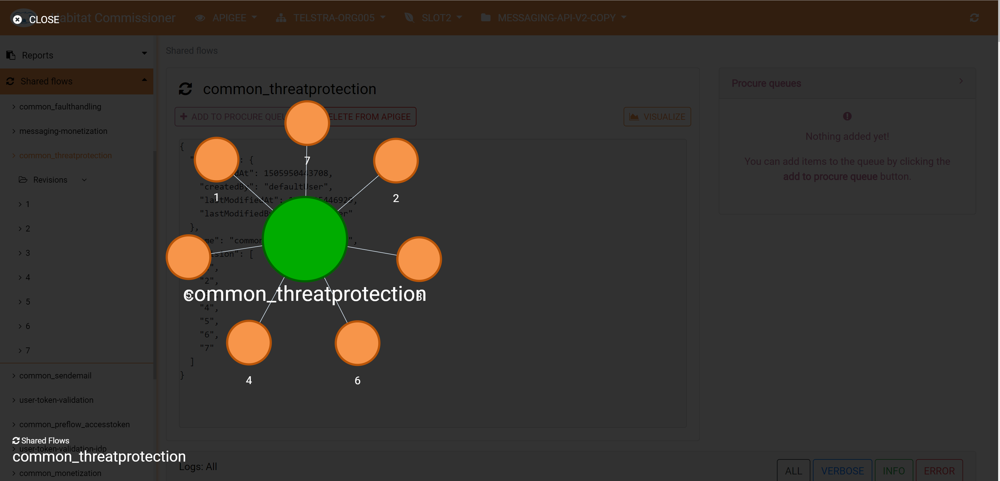

# Apigee visualization
Each selectable item can be visualized by clicking the 'visualize' button in the details box for an item. This will show the immeditate connections of the selected item in a basic graph. For example, an API product will show which proxies it is a part of as well as any monetization packages it is included in. Hovering over a node in this view will provide some additional details about such as who it was last modified by or what revisions are deployed in which environments, in the case of proxies and shared flows.

This visualization could be extended to show all apps the a product uses, for example, or to show all the policies a proxy uses. There is lots of cool uses for a visualization when thinking about API's and how all the components fit together, it looks pretty cool too.

The visualization is built usin [D3.js](https://d3js.org/) with instructions for Angular 5 implementation found on [Medium](https://medium.com/netscape/visualizing-data-with-angular-and-d3-209dde784aeb)

###### Front end guide contents
- [Initial set up](./setup.md)
- [Settings options in the header](./header_options.md)
- [Selecting an item from the sider bar](./item.md)
- [Item queues](./queues.md)
- [Additional options](./additional_options.md)
- [Winston logger](./logger.md)
- [Automated testing](./testing.md)